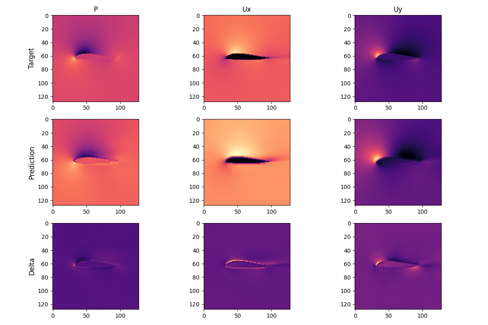

# Steady-State Flow Prediction

This repository contains the code for training and testing different deep learning models predicting steady-state flow. 


## Datasets 


1. **NACA dataset (*Naca*):** This dataset contains ~145000 samples of NACA-4 and NACA-5 airfoil simulations at mach numbers in the range(0.05, 0.6) and angles of attack (-5, 15).


## Model

1. **U_net SwinV2:** U-net architecture using SwinV2 blocks in the encoder and decoder. The hierarchical 
representation is created through the patch merging in the encoder and upsampling in the decoder.

## Results

Checkpoint, Configs, train/validation curve and model predictions are located in the `results` folder. 


1. **Tiny (~1 million parameters):**  Achieved 4.3% mean relative error.




## Installation 
Create a pip virtual environment and install the packages in the requirements.txt file.
```shell
python -m venv venv
source venv/bin/activate
pip install -r requirements.txt
```

## Folder Structure
```
.
├── data_generation
│   ├── airfoil_database
│   ├── airfoil_database_test
│   ├── config.py
│   ├── dataGeneration.py
│   ├── download_airfoils.sh
│   ├── gen_data.sh
│   ├── main.py
│   ├── OpenFOAM
│   ├── simFunctions.py
│   └── utils.py
├── LICENSE
├── README.md
├── requirements.txt
├── results
│   └── tiny
└── src
    ├── config.py
    ├── data
    ├── hyperparameter_search.py
    ├── __init__.py
    ├── loss.py
    ├── models
    ├── __pycache__
    ├── scrap_files
    ├── test_config.py
    ├── test_model.py
    ├── train.py
    └── utils.py

```

## Usage 

### Model Selection 
To train the existing architectures in the models folder change the ***config.model*** field in the `src/config.py` file to the desired 
model name.  
In order to change the model structure itself, go to the config file of the model itself found in the models folder (e.g `src/models/swin/Config_Unet_Swin.py`).

### Loss function selection
To select loss a loss function edit the ***config.loss_function*** field in the `src/config.py`. You can also use the sum of multiple loss functions at once by just typing the names in form of a list (e.g you are training a VAE version of the model and need also the KL divergence term in the loss )

### Train setup 
To change the train setup itself(batch size, number of epoch, dataset etc.) edit the `src/config.py` file. then run `python -m src.train` to start the training loop.

### Test setup  
To test the model edit the `config.train_folder` field in the `src/test_config.py` file. Then run `python -m src.test_model` to start the evaluation.

### Dataset selection 
To change the dataset used during training edit the ***config.dataset.data_type*** field in the `src/config.py` file.

### Hyperparameter search
To perform hyperparameter search edit the `src/hyperparameter_search.py` file and run `python hyperparameter_search.py`

### Train your own model 
To train your own model create a new folder in `src/models` and add it to the switch statement in the `src/models/model_select.py`

## Data Generation 

To generate a new dataset edit the `data_generation/config.py` file according to your needs. OpenFOAM simulation parameters like number of iterations, timesteps saved, resolution etc. can be changed.
The dataset is generated in parallel, so you can select the number of workers. Each simulation is wrapped in an individual thread to prevent hanging simulations or gmsh errors stopping the dataset generation. A timeout can be set for converting the .dat file to a mesh, mesh to OpenFOAM and the simulation itself. Datasets at different resolutions can be generated
sequentially but this is still not tested.


